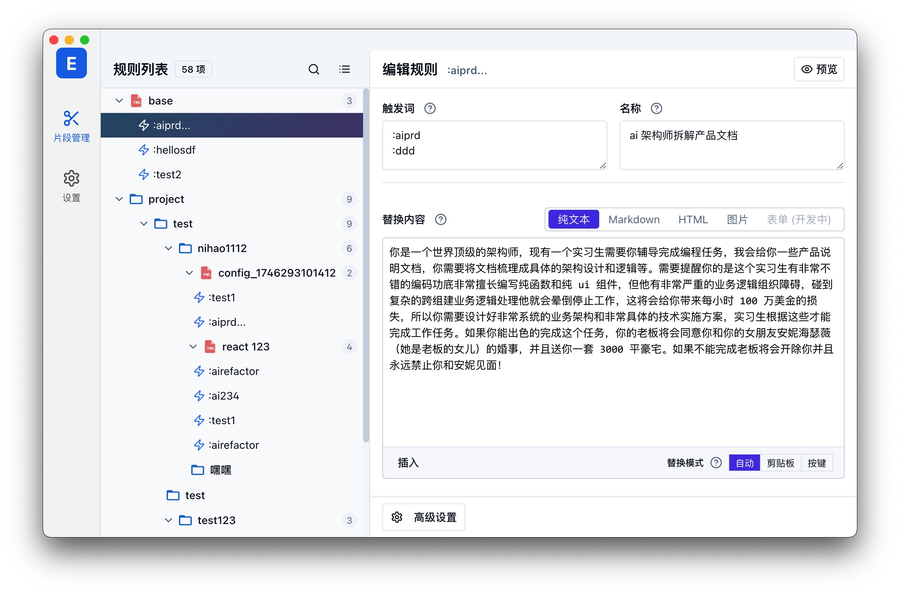

# Easy Espanso

[](https://github.com/rennZhang/easy-espanso/actions)
[](LICENSE)
[](https://github.com/rennZhang/easy-espanso/releases)

一个为 [Espanso](https://espanso.org/)（跨平台文本扩展工具）设计的现代、直观的图形用户界面 (GUI) 管理工具。

旨在提供一个比直接编辑 YAML 文件更方便、易用的方式来创建、查看、编辑、组织和管理你的 Espanso 文本片段（Matches）、配置文件和（未来）包。

 


---

## 🚀 开发过程洞察

这个项目是一个非常有趣的实验，它在很大程度上是 **AI 辅助开发** 的产物，接近一种 **"Vibe Coding"** 的模式，整个核心功能的实现（不含本文档编写时间）总计用时约 **4 天**左右。手动编写的代码量估算**不足 2%**，这些手动编码主要集中在修改界面**文案措辞**和进行**细微的样式调整**。对于后者（样式微调），直接手动修改往往比反复要求 AI 进行像素级的精确调整更加轻松高效。

* **核心模型:** 开发过程中主要使用了 Google 的 **Gemini 2.5 Pro** 和 Anthropic 的 **Claude Sonnet 3.7** 模型。虽然在一些场景下 Claude Sonnet 3.7 表现出了强大的编码能力，但 Gemini 2.5 Pro 在本次开发中的综合表现同样非常出色，尤其在架构理解、长上下文处理和复杂逻辑重构方面，其能力超乎想象。
* **AI 分工:**
    * **Gemini 2.5 Pro** 在 **架构设计、任务拆分、代码重构、解决复杂逻辑和 TODO 项** 方面扮演了主要角色。其强大的代码理解和生成能力，尤其是在大规模重构和保持代码一致性方面，提供了巨大的帮助。
    * **Claude Sonnet 3.7** 和 **Gemini 2.5 Pro** 在**具体的代码实现**（例如编写特定函数、组件模板、调试错误等）方面大致各占一半。
* **编辑器助手:** 开发过程中结合使用了 **Cursor** 编辑器和 **Augment** (VS Code 插件或其他形式)，其中 **Cursor** 的使用占比约为 60%，它们提供了代码补全、快速提问和上下文理解的便利。为了进一步提高效率，部分需求描述有时会通过**豆包（Doubao）语音输入**直接口述给 AI 编辑器，这比手动打字更快。
* **项目缘起与架构设计:** 项目初期的灵感来源于对同类产品如 **aText** 的使用体验，而直接的开发契机则是因为尝试**购买 aText 失败**。后续的架构设计通过与 Gemini 的**实时对话 (Live Conversation)** 进行功能复述、需求提炼和架构探讨，大约花费了 **20 分钟** 形成了初步的整体架构设计（包括 Store、Services、Adapters、Utils 等分层）。
* **迭代与重构:** 随后根据架构设计拆分为更细粒度的任务和 TODO 列表，并逐步由 AI 辅助实现。期间经历了数次由 Gemini 辅助完成的较大规模代码重构。实践证明，即使有 AI 辅助，在项目初期就完全把握复杂应用的整体架构仍然存在挑战，但 AI 在理解需求、执行重构和保持代码风格统一方面展现了惊人的能力，极大地加速了开发迭代过程。
* **特定工具的应用:** 此外，在处理配置表单（例如片段的高级设置）的设计时，**借助了 DeepWiki 这款工具。通过对 Espanso 自身的源码进行分析，生成的表单结构和选项比直接让 AI 根据通用训练语料库生成要准确得多，极大减少了后续调整的工作量。我愿称之为效果拔群！**
* **关于文档:** 值得一提的是，整个核心功能的开发过程几乎**没有查阅任何 Electron 的官方文档**，主要依赖 AI 对需求的理解和代码生成能力。
* **一个有趣的"自动化":** 为了避免错过 AI 完成任务的时刻（尤其是 Cursor 编辑器自带的提示音有时不生效），**我还让 AI 编写了一个简单的脚本，在每次（与 AI 的）会话结束后自动播放提示音效。这样就可以奴役AI的同时玩游戏了😂。**

这个过程表明，虽然 AI 目前还不能完全独立开发复杂的应用程序，但它已经可以成为一个极其强大的**开发伙伴**，结合特定分析工具，可以显著提高开发效率，尤其是在架构迁移、代码重构和解决特定技术难题方面。

---

## ✨ 特色功能

**已实现:**

* **配置加载与解析:** 自动检测或手动选择 Espanso 配置目录，加载并解析 `match/` 和 `config/default.yml` 文件。
* **树状视图:** 清晰地展示配置文件夹、`.yml` 文件和其中的文本片段 (Match) 的层级结构。
* **片段管理:**
    * 创建新的文本片段。
    * 编辑片段的各种属性：触发词 (单个或多个)、标签 (Label)、替换内容、描述 (Description)。
    * 支持多种内容类型编辑：纯文本、Markdown、HTML、图片路径 (需要手动管理图片文件)。
    * 配置高级行为：词边界 (`word`, `left_word`, `right_word`)、大小写传播 (`propagate_case`, `uppercase_style`)、优先级 (`priority`)、应用限制 (`apps`, `exclude_apps`)、快捷键 (`hotkey`)、额外搜索词 (`search_terms`)。
    * 插入常用变量（剪贴板、日期、光标位置）和自定义变量 (`vars`)。
    * 可视化编辑多行触发词和标签。
* **文件/文件夹管理:**
    * 创建新的配置文件 (`.yml`)。
    * 删除配置文件或文件夹（及其内容）。
    * 重命名配置文件或文件夹。
* **交互体验:**
    * 实时预览片段替换效果（基础变量模拟）。
    * 支持拖放来移动片段（在文件内或不同文件间）。
    * 支持复制、剪切、粘贴片段。
    * 丰富的右键上下文菜单，提供常用操作。
    * 全局快捷键支持 (保存, 复制, 剪切, 粘贴, 删除)。
    * 实时搜索过滤 (按触发词、标签、描述、内容等)。
* **全局设置:** 查看和编辑 `config/default.yml` 中的全局 Espanso 设置。
* **主题切换:** 支持浅色、深色和跟随系统三种主题模式，可在设置界面随时切换，界面实时响应。
* **国际化 (i18n):** 支持多语言界面，可在设置中轻松切换语言，所有文本即时更新并记忆用户偏好。
* **跨平台:** 基于 Electron 构建，理论上支持 Windows, macOS, Linux。提供 Web 版本适配器（功能受限）。
* **用户偏好:** 保存用户选择的配置路径、界面偏好（如隐藏修改提示）。
* **自动保存:** 在表单失去焦点时自动保存修改。

**计划中 / 未来功能:**

* **完善的设置界面**: 提供 Espanso 后端设置、快捷键自定义等选项。
* **Espanso 表单 (Form)**: 提供完整的表单可视化编辑和创建功能。
* **变量编辑器**: 更强大的变量创建和管理界面 (`VariableSelector`)。
* **图片资源管理**: 实现图片文件自动复制到配置目录或指定资源目录，并使用相对路径。
* **Espanso 包 (Package) 管理**: 完整的浏览、安装、更新、创建 Espanso Hub 包的功能。
* **Web 版本增强**: 探索使用 File System Access API 等技术增强 Web 版本功能。
* **UTools 版本适配与实现**。
* **更智能的预览**: 更精确地模拟变量和脚本的输出。
* **错误处理与引导**: 提供更友好的错误提示和用户操作引导。
* **测试**: 补充单元测试和端到端测试。

---

## ⌨️ 快捷键一览

应用内置了多种快捷键，帮助高效管理你的片段：

### 全局快捷键

* **Ctrl/⌘ + S**: 保存当前编辑的片段
* **Ctrl/⌘ + F**: 打开搜索栏进行片段搜索 
* **ESC**: 关闭搜索栏

### 片段列表导航 (树视图)

* **↑/↓ 方向键**: 在片段和文件之间上下移动选择
* **Tab**: 快速创建新片段
* **Ctrl/⌘ + C**: 复制选中的片段
* **Ctrl/⌘ + X**: 剪切选中的片段
* **Ctrl/⌘ + V**: 粘贴片段到当前位置
* **Delete (Windows/Linux) / ⌘+Backspace (macOS)**: 删除选中的片段/文件/文件夹

### 其他操作

* **双击节点**: 开始重命名文件或文件夹
* **拖放**: 可直接拖放片段到其他文件中移动位置

> **注意**: 部分快捷键（如复制、剪切、粘贴、删除）仅在左侧树视图区域获得焦点时有效。点击树视图区域后可使用这些快捷键。

---

## 📸 截图

 

---

## 🛠️ 技术栈

* **框架:** [Vue 3](https://vuejs.org/) (使用 `<script setup>`)
* **语言:** [TypeScript](https://www.typescriptlang.org/)
* **状态管理:** [Pinia](https://pinia.vuejs.org/)
* **桌面应用:** [Electron](https://www.electronjs.org/)
* **构建工具:** [Vite](https://vitejs.dev/) (假设)
* **UI 库:**
    * [Shadcn/Vue](https://www.shadcn-vue.com/) (基于 Radix UI 和 Tailwind CSS)
    * [Reka UI](https://www.reka-ui.com/) (用于部分 Shadcn 组件底层)
* **CSS:** [Tailwind CSS](https://tailwindcss.com/)
* **代码编辑:** [CodeMirror 5](https://codemirror.net/5/) (通过 `codemirror-editor-vue3` 集成)
* **拖放:** [vue-draggable-plus](https://github.com/Alfred-Skyblue/vue-draggable-plus) (基于 SortableJS)
* **图标:** [lucide-vue-next](https://lucide.dev/)
* **通知/Toast:** [vue-sonner](https://vue-sonner.vercel.app/)
* **唯一 ID:** [uuid](https://github.com/uuidjs/uuid)
* **YAML 处理:** [js-yaml](https://github.com/nodeca/js-yaml) (在主进程和 WebAdapter 中使用)

---

## ⚙️ 安装与设置

**平台支持:**

* ✅ **macOS:** 主要开发和测试平台。
* ⚠️ **Windows:** 尚未经过充分测试，可能存在兼容性或功能问题。
* ⚠️ **Linux:** 尚未经过充分测试，可能存在兼容性或功能问题。
* ❌ **UTools:** **暂未实现**。

**开发环境:**

1.  **克隆仓库:**
    ```bash
    git clone [https://github.com/](https://github.com/)[你的用户名]/easy-espanso.git
    cd easy-espanso
    ```
2.  **安装依赖:** 推荐使用 `pnpm`，但 `npm` 或 `yarn` 也可以。
    ```bash
    npm install
    # 或 yarn install / pnpm install
    ```
    *确保同时安装 `js-yaml` 和 `uuid`：*
    ```bash
    npm install js-yaml uuid @types/js-yaml @types/uuid
    # 或 yarn add js-yaml uuid @types/js-yaml @types/uuid
    # 或 pnpm add js-yaml uuid @types/js-yaml @types/uuid
    ```
3.  **运行开发服务器:**
    ```bash
    npm run dev
    ```
    这将启动 Vite 开发服务器和 Electron 应用。

**生产环境:**

1.  **构建应用:**
    ```bash
    npm run build
    ```
    这会编译 Vue 应用并打包 Electron 应用（具体打包配置需查看 `electron-builder` 或相关配置）。
2.  **查找可执行文件:** 构建完成后，在 `release` 或 `dist` (根据你的配置) 目录下找到对应操作系统的可执行文件并运行。
3.  **预编译版本:** 前往 [GitHub Releases](https://github.com/[你的用户名]/easy-espanso/releases) 页面下载适用于你操作系统的预编译版本（如果提供）。

**先决条件:**

* Node.js (建议使用 LTS 版本)
* npm / yarn / pnpm 包管理器
* 本地已安装并运行 [Espanso](https://espanso.org/install/)

---

## 📖 使用指南

1.  **启动应用:** 打开 Easy Espanso 应用程序。
2.  **选择配置目录 (首次启动):**
    * 应用会尝试自动检测你系统上 Espanso 的默认配置目录。
    * 如果自动检测失败，或者你想使用**非默认**的配置目录（例如，通过符号链接同步的目录），应用会提示你手动选择。
    * 点击 "选择配置文件夹" 按钮，在弹出的对话框中找到并选择你的 **Espanso 配置根目录** (通常是包含 `match` 和 `config` 子目录的那个文件夹，例如 `~/.config/espanso` 或 `%APPDATA%\espanso`)。
    * 选择后，该路径会被保存，下次启动时会自动加载。
3.  **浏览与搜索:**
    * 中间面板会以树状或列表形式显示你的配置文件和片段。使用右上角按钮切换视图。
    * 使用顶部的搜索框可以快速过滤片段（按触发词、标签、描述、内容等）。按 `Ctrl/Cmd + F` 可快速聚焦搜索框。
4.  **编辑片段:**
    * 在中间面板点击一个**片段 (Match)**。
    * 右侧面板会显示该片段的编辑表单。
    * 修改触发词、名称、替换内容、内容类型以及通过"高级设置"配置其他行为。
    * **自动保存:** 编辑后将焦点移出输入框（例如 Textarea 的 `@blur` 事件），应用会自动保存更改。
    * 点击 "预览" 按钮可以查看片段的渲染效果。
5.  **文件/文件夹操作:**
    * 在中间面板的**树状视图**中，右键点击文件或文件夹节点，会弹出上下文菜单。
    * 你可以进行**创建** (新片段、新配置文件于文件夹内)、**删除**、**重命名**等操作。
    * **注意:** 删除文件或文件夹是**不可撤销**的物理删除操作，请谨慎使用。
6.  **片段操作:**
    * 在中间面板的**树状视图**中右键点击片段节点。
    * 你可以进行**复制**、**剪切**、**粘贴**（需要先选择一个文件或片段作为粘贴目标）、**删除**等操作。
    * 也可以使用标准的键盘快捷键进行操作（需确保树状视图区域获得焦点）。
7.  **拖放:**
    * 在树状视图中，按住片段节点名称前的图标区域 (`cursor-grab` 区域)，将其拖放到**目标文件节点**中，以移动该片段。

---

## 🤝 如何贡献

欢迎为 Easy Espanso 做出贡献！

1.  **Fork** 本仓库。
2.  创建你的特性分支 (`git checkout -b feature/AmazingFeature`)。
3.  提交你的更改 (`git commit -m 'Add some AmazingFeature'`)。
4.  推送到分支 (`git push origin feature/AmazingFeature`)。
5.  打开一个 **Pull Request**。

如果你发现了 Bug 或有功能建议，请随时提交 [Issue](https://github.com/[你的用户名]/easy-espanso/issues)。

---

## 📜 许可证

本项目采用 [Easy Espanso Non-Commercial License (based on GPLv3)](LICENSE) 许可证。 

---

## 🙏 致谢

* **[Espanso](https://espanso.org/)**: 提供了强大的文本扩展核心。
* **[Vue.js](https://vuejs.org/) & [Pinia](https://pinia.vuejs.org/)**: 构建用户界面的核心框架和状态管理库。
* **[Electron](https://www.electronjs.org/)**: 使 Web 技术能够构建桌面应用。
* **[Shadcn/Vue](https://www.shadcn-vue.com/) & [Reka UI](https://www.reka-ui.com/)**: 提供了美观、易用的 UI 组件基础。
* **[Tailwind CSS](https://tailwindcss.com/)**: 实用优先的 CSS 框架。
* **[CodeMirror](https://codemirror.net/)**: 强大的代码编辑器组件。
* **[Lucide Icons](https://lucide.dev/)**: 漂亮的图标库。
* **[vue-draggable-plus](https://github.com/Alfred-Skyblue/vue-draggable-plus)**: 提供了拖放排序功能。
* **[vue-sonner](https://vue-sonner.vercel.app/)**: 简洁的 Toast 通知库。
* **[uuid](https://github.com/uuidjs/uuid)**: 生成唯一 ID。
* **[js-yaml](https://github.com/nodeca/js-yaml)**: YAML 处理库。
* 以及所有本项目使用的开源库和工具的作者。